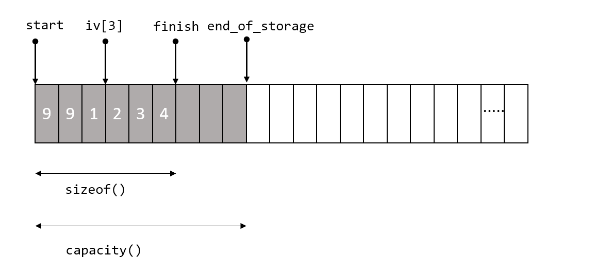
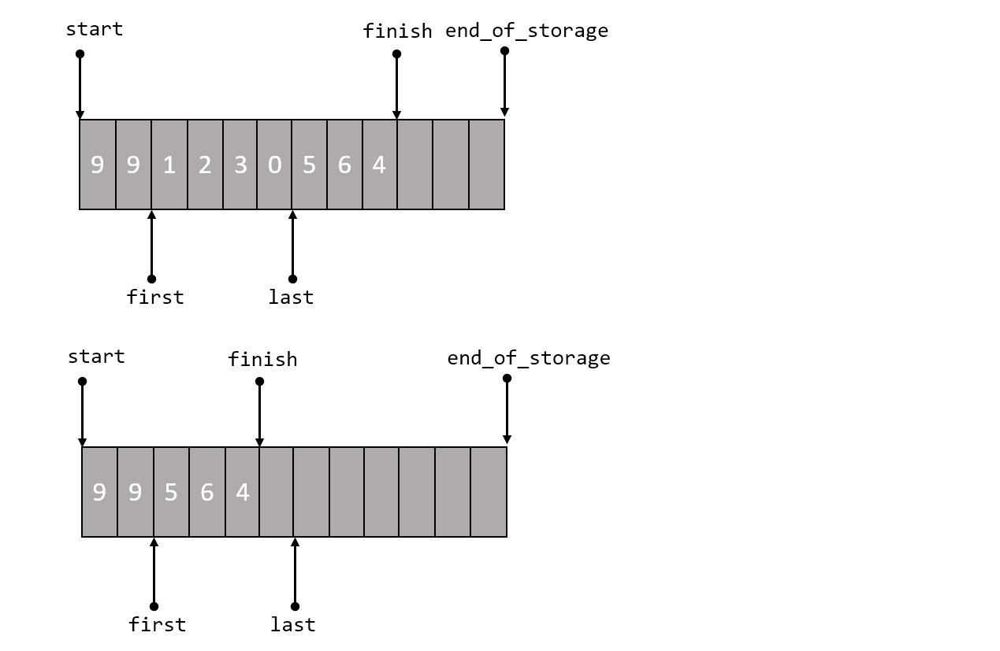

### Container - Vector

- 迭代器： `[start, end)`
- `push_back`
    - 当`push_back`元素到`vector`尾端时要先检查是否有空闲空间
    - 如果有直接在备用空间上构造元素，并调整迭代器`finish`
    - 如果没有，就扩充空间 `insert_aux`

- `pop_back`

- `erase`
    - `erase(position)`
    - `erase(first, last)`
        

- `insert`
    - 